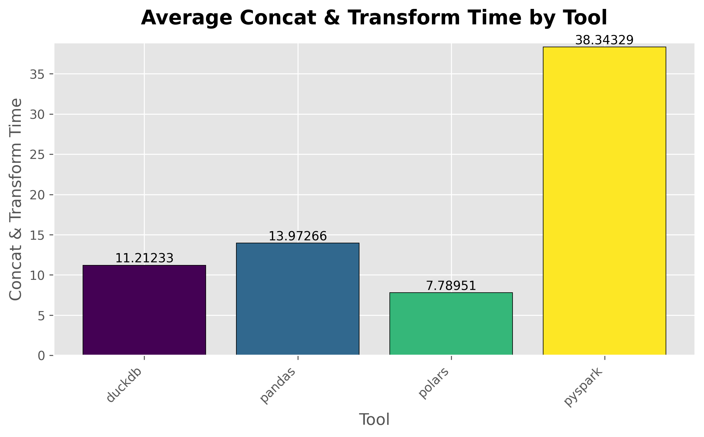
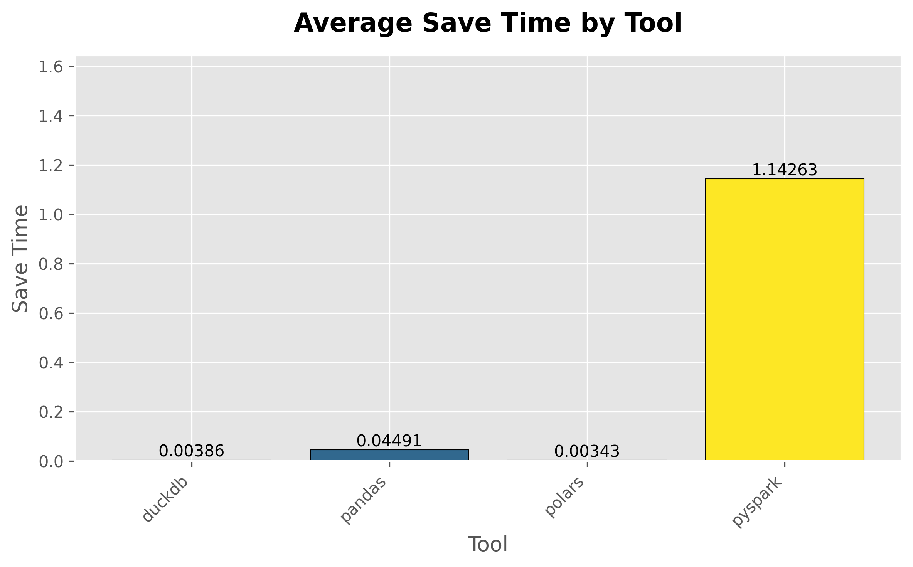
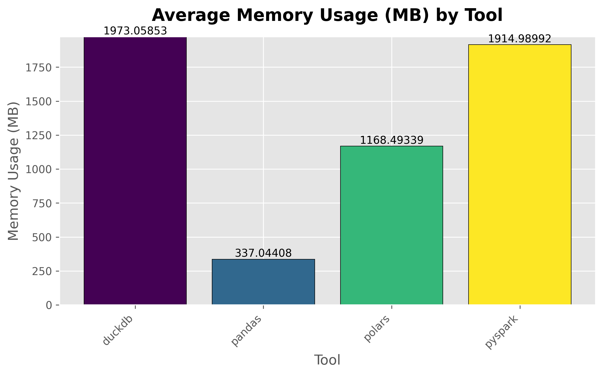
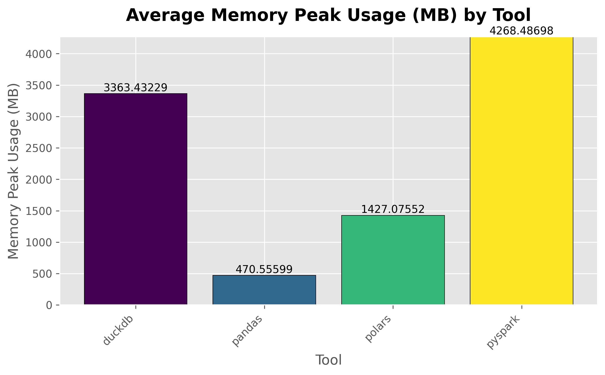
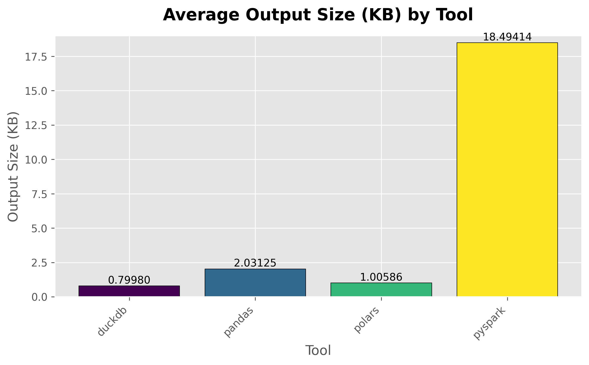

# T\&D — Comparativo de Engines (PySpark × Pandas × Polars × DuckDB)

## Objetivo

Comparar **desempenho de processamento**, **uso de memória** e **tamanho/estrutura do arquivo final** ao processar dados do *New York Yellow Taxi Trip Data* com **PySpark**, **Pandas**, **Polars** e **DuckDB** em um pipeline idêntico (CSV → concatenação → transformações → agregação → Parquet).

## Dados de Entrada

* Múltiplos arquivos **CSV** do conjunto:
* Fonte: *New York Yellow Taxi Trip Data (2019–2020)* disponível em: [https://www.kaggle.com/datasets/microize/newyork-yellow-taxi-trip-data-2020-2019](https://www.kaggle.com/datasets/microize/newyork-yellow-taxi-trip-data-2020-2019)

## Metodologia

1. **Ambiente (Docker)**

   * 1 container por ferramenta (**PySpark**, **Pandas**, **Polars**, **DuckDB**) para isolar dependências.
   * Scripts equivalentes em cada container executam o mesmo fluxo e a mesma instrumentação.

2. **Pré-processamento e Pipeline**

   * Leitura de todos os **.csv**.
   * **Concatenação** dos arquivos (schemas compatíveis).
   * **Transformações**:

     * filtro `tip_amount > 0`;
     * extração da **hora do dia** a partir de `tpep_pickup_time`.
   * **Agregação**: média de `tip_amount` por **hora** (0–23).
   * Impressão do resultado e **salvamento em Parquet**.

3. **Medições e Repetições**

   * **Tempo** (em s) por fase:

     * **Concatenação + Transformações** (agrupadas);
     * **Salvamento**.
   * **Memória**: **média** e **pico** por execução.
   * Cada ferramenta executada **3 vezes**; resultados salvos em `metrics.csv` e analisados pelas **médias**.

4. **Análise de Resultados**

   * Consolidação das métricas médias por ferramenta.
   * Geração de gráficos para cada métrica (tempo, memória, tamanho).
   * Comparação e discussão dos *trade-offs*.

## Resultados Obtidos

> Valores abaixo refletem as **médias** dos 3 experimentos por ferramenta.
> Quando não houver valor numérico informado neste resumo, foi mantido como **—**.

| Ferramenta  |                       Concat + Transform (s) | Salvamento (s) |   Mem. média | Pico de Mem. | Parquet (KB) / Layout                          |
| ----------- | -------------------------------------------: | -------------: | -----------: | -----------: | ---------------------------------------------- |
| **PySpark** |                        (maior que as demais) |     **1.1400** |    \~2.00 GB |  **4.20 GB** | **18.5 KB** / **pasta com múltiplos arquivos** |
| **Pandas**  |                                     razoável |         0.0440 | **\~337 MB** | **\~370 MB** | **2.03 KB** / arquivo único                    |
| **Polars**  | **menor tempo** (\~30% mais rápido que o 2º) |     **0.0035** |    \~1.16 GB |      1.42 GB | **1.00 KB** / arquivo único                    |
| **DuckDB**  |                                     razoável |     **0.0035** |    \~2.00 GB |      3.36 GB | **0.80 KB** / arquivo único                    |

> **Observação:** o **PySpark** salva por padrão em **partições múltiplas** (pasta com vários arquivos), enquanto as demais ferramentas salvaram **um único arquivo**.

## Plots

## Análise dos Resultados

* **Concatenação + Transformações**

  * **PySpark**: claramente **mais lento** que as demais neste volume.
  * **Polars**: **mais rápido**, aproximadamente **30%** à frente do segundo colocado.
  * **Pandas** e **DuckDB**: tempos **intermediários/razoáveis**.

* **Tempo de Salvamento**

  * **Polars** e **DuckDB**: **muito rápidos** (\~**0,0035 s**).
  * **Pandas**: rápido (**0,044 s**).
  * **PySpark**: o **mais lento** (**\~1,14 s**).

* **Uso de Memória (média e pico)**

  * **Pandas**: **menor uso** (média \~**337 MB**, pico \~**370 MB**).
  * **Polars**: **moderado** (média \~**1,16 GB**, pico **1,42 GB**).
  * **DuckDB**: **elevado** (média \~**2,0 GB**, pico **3,36 GB**).
  * **PySpark**: **pico** mais alto (**4,2 GB**); a **média** não foi informada neste resumo.

* **Tamanho/estrutura do Parquet**

  * **PySpark**: **18,5 KB** em **múltiplos arquivos** (particionado) — benéfico para leitura seletiva em **datasets grandes**.
  * **DuckDB**: **0,8 KB**, arquivo único.
  * **Polars**: **1,0 KB**, arquivo único.
  * **Pandas**: **2,03 KB**, arquivo único.

## Conclusões e Recomendações

* **Pandas**: excelente quando os dados **cabem na memória**; **baixo consumo** e performance **razoável**.
* **Polars**: melhor **tempo de processamento** (concat + transform) e **salvamento**; bom equilíbrio de **desempenho** com **memória moderada**.
* **DuckDB**: tempos **adequados**, porém **memória** mais alta neste cenário; forte opção para **SQL embutido** e análise local.
* **PySpark**: **overhead** mais alto em tempo e memória para este volume; porém entrega **layout particionado**, vantagem em **escala** e em **consultas seletivas** sobre **datasets muito grandes** ou **execução distribuída**.

## Reprodutibilidade

1. **Baixe os dados** do Kaggle e posicione os CSVs no diretório de entrada definido pelos scripts (ex.: `data/`).
2. **Construa e execute** os containers (1 por ferramenta), rodando os scripts correspondentes (ex.: `run_pyspark.py`, `run_pandas.py`, `run_polars.py`, `run_duckdb.py`).
3. **Repita 3 vezes** por ferramenta; cada execução gera um `metrics.csv`.
4. **Agregue e analise** as métricas (tempo de concat+transform, tempo de salvamento, memória média/pico, tamanho do Parquet) e gere os gráficos por métrica.
5. **Compare os resultados** com base nas médias e nos gráficos.